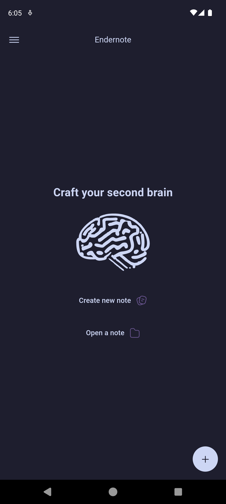
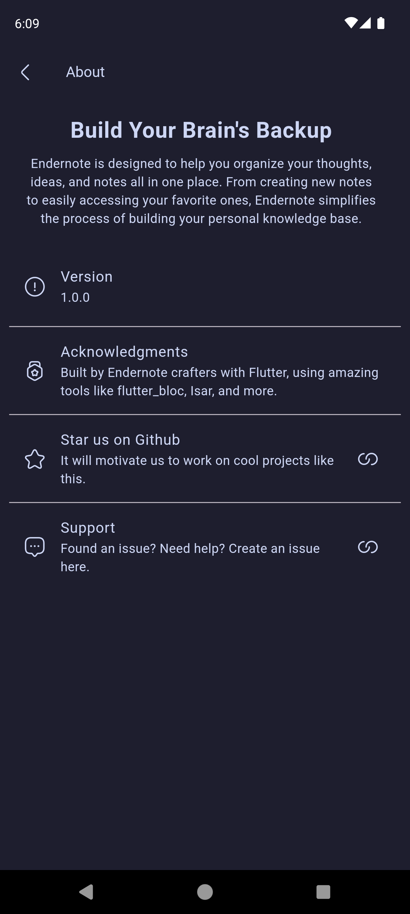

# EnderNote

Welcome to EnderNote! 🚀 EnderNote is a sleek and powerful note-taking application designed to boost your productivity. Built with Flutter, EnderNote provides a seamless and efficient note-taking experience.

## Features

- ⚡ **Lightning Fast**: Utilizes Flutter for smooth performance and quick load times.
- ☁️ **Cloud Sync**: Sync your notes across devices.
- 📝 **Markdown Support**: Write notes in Markdown with live preview.
- 🔍 **Full-Text Search**: Quickly find your notes with robust search functionality (coming soon).
- 📁 **Organized Folders**: Organize your notes into folders for better management (coming soon).

## 📸 Screenshot

<p align="center">
  
  
</p>

## Getting Started

### Prerequisites

- Flutter (v2+ recommended)
- Dart (v2.12+)
- Firebase Project with Firestore and Authentication enabled

### Installation

#### Clone the repository:

```bash
git clone https://github.com/shaaanuu/endernote.git
cd endernote
```

#### Install dependencies:

```bash
flutter pub get
```

#### Set up Firebase:

1. Create a Firebase project at [Firebase Console](https://console.firebase.google.com/).
2. Create a new file called `api_key.dart` in the lib folder and add your Firebase web API key and the database URL:

```dart
const firebaseWebApi = "blablablaa";
const databaseURL = "https://blablalblaa.firebaseio.com";
```

#### Start the development server:

```bash
flutter run
```

## Contributing

We welcome contributions! Please see our [CONTRIBUTING.md](https://github.com/shaaanuu/endernote/blob/main/CONTRIBUTING.md) for details on how to get started.

## License

This project is licensed under the MIT License. See the [LICENSE](https://github.com/shaaanuu/endernote/blob/main/LICENSE) file for details.

## Acknowledgements

- Inspired by [Obsidian](https://obsidian.md/).
- Powered by [Flutter](https://flutter.dev/).
- State management by [flutter_bloc](https://pub.dev/packages/flutter_bloc).
- Backend by [Firebase](https://firebase.google.com/docs).
