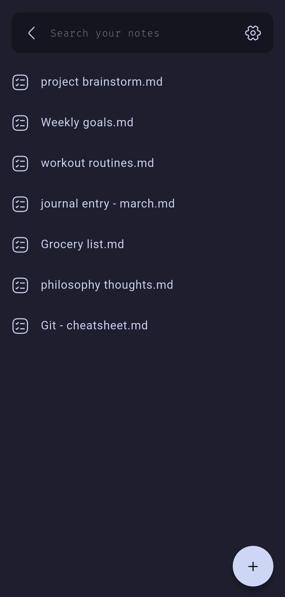
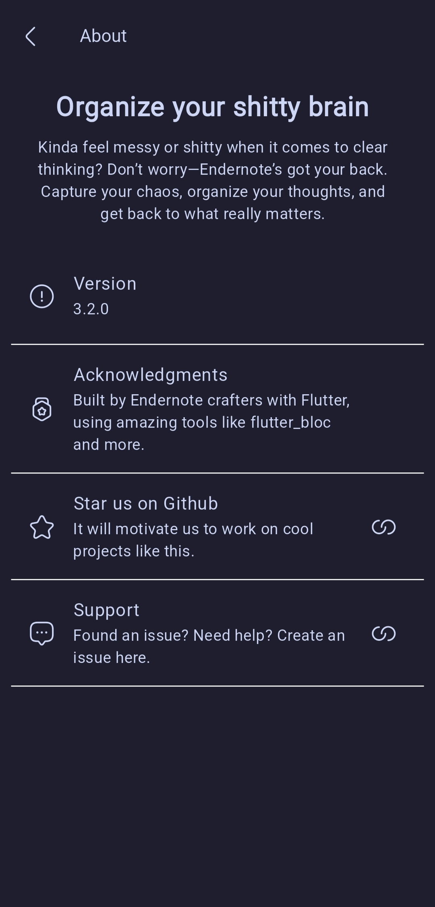
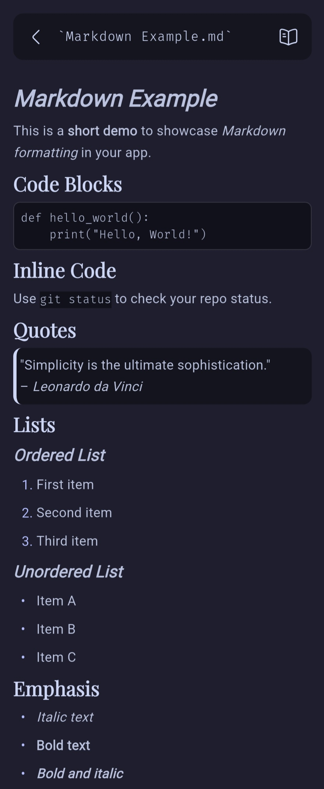

# **EnderNote**

_"Notes, Redefined. Markdown-powered productivity."_

Welcome to **EnderNote**—a minimal, fast, and open-source note-taking app designed for those who demand simplicity and power in one. Built with Flutter and Firebase, EnderNote delivers seamless note-taking for writers, organizers, and power users alike.

---

## **✨ Features**

### **Built for Productivity**

- 📝 **Markdown Support**: Write with Markdown, see live previews.
- ☁️ **Cloud Sync**: Access your notes anywhere, anytime _(currently unavailable)_.
- 🔍 **Full-Text Search**: Quickly find your notes.
- 📁 **Organized Folders**: Keep your workspace tidy and intuitive.

---

## **🚀 Why EnderNote?**

- **Open Source**: Free and customizable for your needs.
- **Cross-Platform**: Runs on Android, Linux, Windows. _(macOS and iOS builds currently unavailable.)_
- **Lightning-Fast**: Powered by Flutter, ensuring smooth performance on every device.

---

## **📸 Screenshots**

<p align="center">
  
  
  
  
</p>

---

## **🚦 Quick Start**

### **Clone the Repo**

```bash
git clone https://github.com/shaaanuu/endernote.git
cd endernote
```

### **Install Dependencies**

```bash
flutter pub get
```

### **Run the App**

```bash
flutter run
```

---

## **🙌 Acknowledgements**

EnderNote exists thanks to:

- 🌿 **[Flutter](https://flutter.dev)**: The engine behind smooth, cross-platform magic.
- ☁️ **[Firebase](https://firebase.google.com)**: Our cloud-based brain, keeping your notes safe and synced.
- 💡 **[Obsidian](https://obsidian.md)**: The spark of inspiration that led us here.

Special thanks to the open-source community—building the future, one commit at a time. 🚀

---

## **📜 License**

Licensed under [MIT](https://github.com/shaaanuu/endernote/blob/main/LICENSE). Do whatever you want (responsibly).

---

## **🤝 Contributing**

We’d love your help to make EnderNote even better! Here’s how you can contribute:

1. **Report Issues**: Found a bug? Open an issue [here](https://github.com/shaaanuu/endernote/issues).
2. **Submit Features**: Have an idea? Let’s discuss it in the issues or pull requests.
3. **Code Contributions**: Fork the repo, create a branch, and submit a pull request.

For more details, check out our [CONTRIBUTING.md](https://github.com/shaaanuu/endernote/blob/main/CONTRIBUTING.md).
